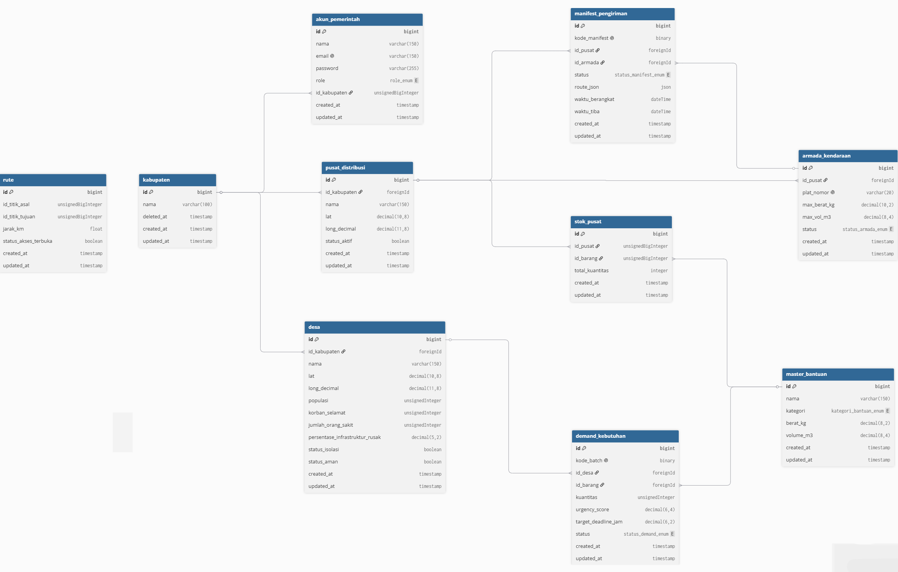
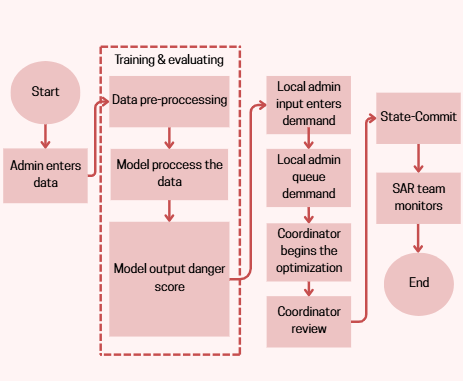
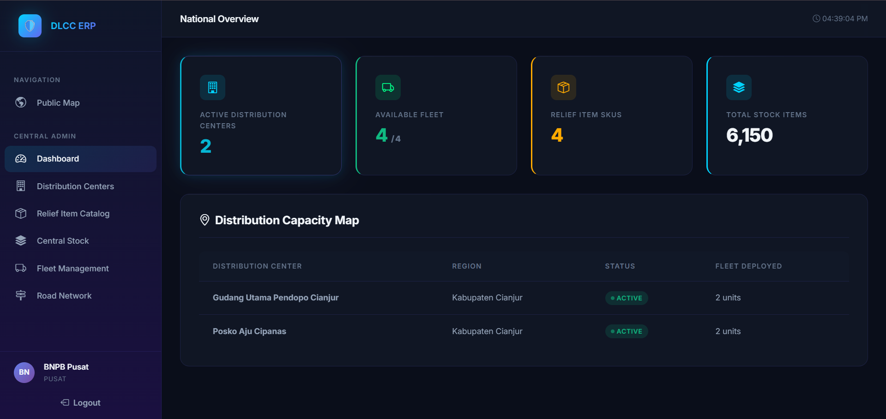
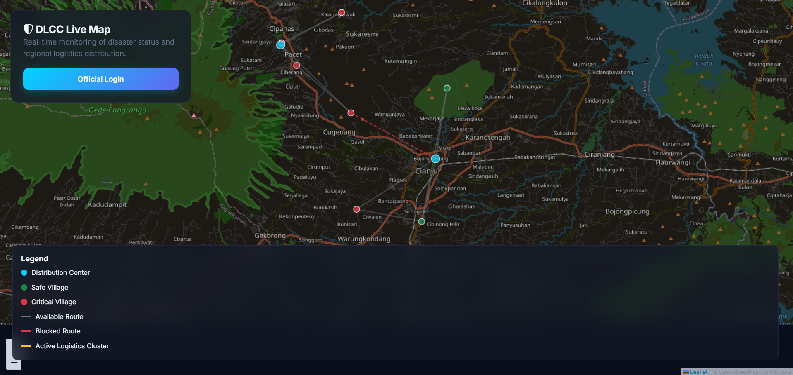
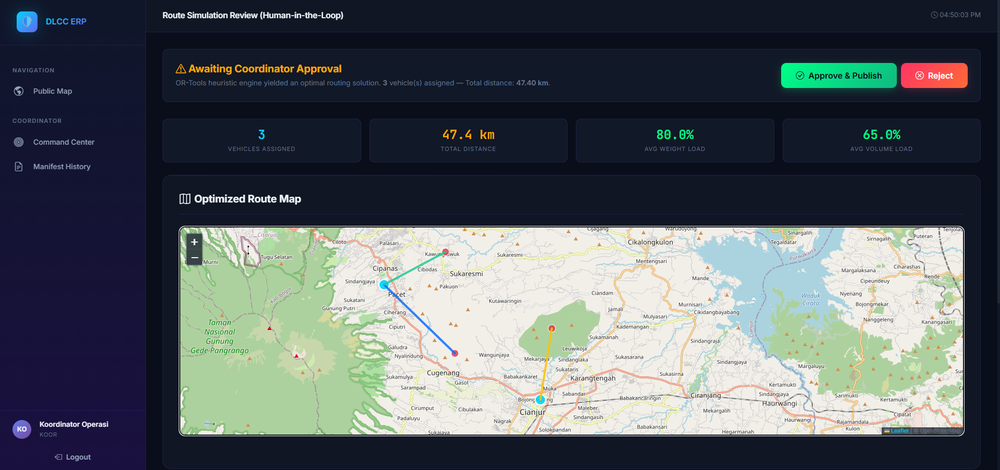
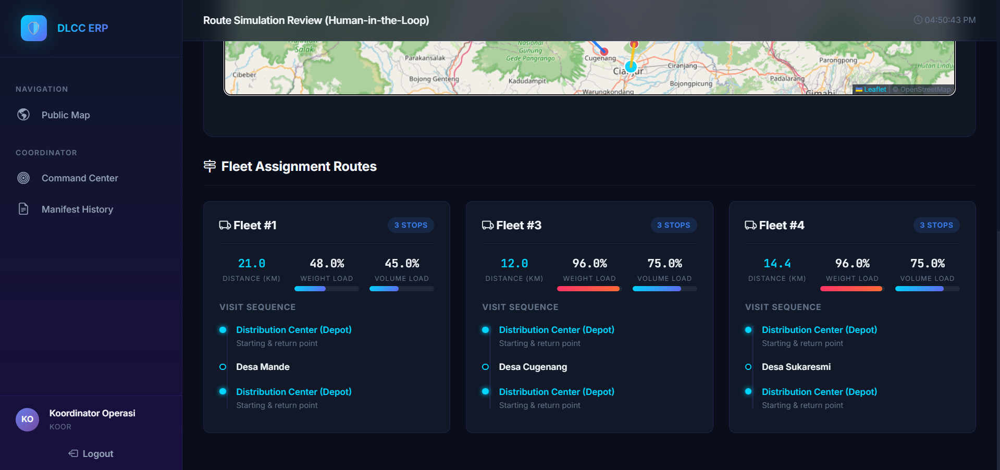

# Disaster Logistics Command Center (DLCC) ERP


*(Silakan masukkan gambar banner aplikasi di sini)*

Disaster Logistics Command Center (DLCC) ERP adalah sebuah sistem Enterprise Resource Planning untuk manajemen logistik kebencanaan. Sistem ini memanfaatkan Machine Learning untuk memprediksi tingkat urgensi kebutuhan wilayah terdampak dan algoritma Operations Research (CVRPTW) untuk mengoptimalkan rute distribusi bantuan logistik.

---

## 🏗️ 1. Arsitektur Keseluruhan Sistem

Sistem ini terbagi menjadi beberapa komponen utama yang bekerja secara bersamaan (Monolith + Microservice):


*(Silakan masukkan diagram arsitektur di sini)*

1. **Frontend (Browser / User)**: Menggunakan Bootstrap 5 untuk Dashboard dan Leaflet.js untuk Peta Interaktif (Public Map).
2. **Backend Utama (Laravel 11)**: Menangani Autentikasi (RBAC), Manajemen CRUD, Session, serta mengatur *State-Commit* dari hasil optimasi.
3. **Microservice AI/OR (FastAPI)**: Menjalankan model Machine Learning (RandomForest) untuk *Urgency Prediction* dan OR-Tools untuk menyelesaikan masalah *Capacitated Vehicle Routing Problem with Time Windows* (CVRPTW).
4. **Environment ML**: Berisi skrip training untuk memodelkan data prediksi urgensi (`notebook_urgency_training.py`).

---

## 🗄️ 2. Skema Database

Sistem ini menggunakan SQLite dengan 11 skema migrasi dan 10 tabel utama:



1. `akun_pemerintah` — Menyimpan data pengguna dengan 4 Role berbeda beserta relasi ke kabupaten.
2. `kabupaten` — Data wilayah administratif.
3. `pusat_distribusi` — Data Gudang atau Depot (Node awal rute).
4. `desa` — Data desa terdampak bencana (berisi 5 fitur ML + koordinat GPS).
5. `rute` — Menyimpan informasi *Edge Graph* (jarak antar titik dalam KM dan status aksesibilitas jalan).
6. `master_bantuan` — Data SKU (Stock Keeping Unit) barang bantuan yang dibagi dalam 4 kategori.
7. `stok_pusat` — Informasi kuantitas stok untuk setiap barang di setiap pusat distribusi.
8. `armada_kendaraan` — Data spesifikasi kendaraan logistik (kapasitas berat dan volume).
9. `manifest_pengiriman` — Data pengiriman bantuan (menggunakan UUID) beserta jalur rute yang telah dioptimasi.
10. `demand_kebutuhan` — Catatan permintaan kebutuhan dari daerah terdampak (memiliki status siklus hidup).

---

## 🔄 3. Alur Pemanggilan & Routing (Business Flow)

Alur kerja aplikasi dirancang menggunakan pendekatan *Human-in-the-Loop* dan *Two-Phase Protocol* untuk pengiriman data:



1. **Input Demand (Admin Daerah)**: Admin Daerah menginputkan permintaan (Demand) barang bantuan untuk desa terdampak. Sistem akan menghitung *BurnRate* awal, dengan status awal `Draft`.
2. **Pengantrian Demand**: Admin Daerah mereview demand dan memindahkannya ke status `Queued` (siap diproses oleh sistem optimasi).
3. **Trigger Optimasi (Koordinator)**:
   - Koordinator menjalankan optimasi via Laravel.
   - **Phase 1A**: Laravel mengirim request HTTP POST ke FastAPI `/api/predict-urgency`. Model ML memperbarui skor urgensi (0-10).
   - **Phase 1B**: Laravel membangun matriks jarak menggunakan algoritma Floyd-Warshall berdasarkan data peta dan rute yang terbuka/terblokir, lalu mengirim HTTP POST ke FastAPI `/api/optimize`.
   - FastAPI (OR-Tools) mengkalkulasi rute terbaik untuk armada dan mengembalikan rute optimal.
4. **Review & Approval (Koordinator)**:
   - Hasil simulasi disimpan ke Session. Koordinator meninjau rute dan distribusi kendaraan di layar.
   - Koordinator melakukan *Approve* atau *Reject*.
5. **State-Commit / Transaksi**:
   - Jika disetujui (Approve), Laravel melakukan transaksi Database (`DB::beginTransaction()`).
   - Sistem melakukan *pessimistic lock* pada stok dan armada, mendeduksi stok, lalu membuat `manifest_pengiriman` dengan status `In-Transit`.
   - Status armada berubah menjadi `In-Transit` dan Demand menjadi `Manifested`.
6. **Penyelesaian**: Setelah bantuan sampai, Koordinator mengubah manifest menjadi `Delivered`. Armada kembali `Available`, dan Demand menjadi `Fulfilled`.
7. **Tim SAR Monitoring**: Tim SAR (via dashboard) dapat mengubah status rute (misalnya terblokir karena longsor) atau status desa, yang akan langsung berdampak pada kalkulasi matriks jarak (Floyd-Warshall) di optimasi selanjutnya.

---

## 🧮 4. Detail Algoritma Operations Research (OR)

Modul OR pada sistem ini (berjalan di microservice FastAPI) difungsikan untuk merancang rute pengiriman bantuan seefisien mungkin. Berikut cara kerjanya:

**Algoritma yang Digunakan**
- Menggunakan **Google OR-Tools** untuk memecahkan persoalan **CVRPTW (Capacitated Vehicle Routing Problem with Time Windows)** yang dimodifikasi.
- Pencarian rute menggunakan strategi awal *Local Cheapest Insertion* dan metaheuristik *Guided Local Search*.
- Memiliki fungsi penalti berbasis urgensi (dari output model Machine Learning). Desa dengan skor urgensi lebih tinggi diberikan *drop penalty* yang sangat masif, memaksa *solver* untuk memprioritaskan pelayanan ke desa tersebut meskipun jaraknya agak jauh.

**Data yang Diolah (Input)**
Data yang dikirimkan dari Laravel ke FastAPI berupa JSON meliputi:
1. **`depots`**: Data titik awal keberangkatan armada (Pusat Distribusi).
2. **`nodes`**: Titik lokasi tujuan (Desa Terdampak), mencakup target jendela waktu (*time windows*), beban muatan (`berat_demand`), volume (`vol_demand`), dan skor urgensi (`urgency_score`).
3. **`fleet`**: Data kumpulan armada yang bersedia beserta batasan kapasitasnya (`max_berat` dan `max_vol`).
4. **`distance_matrix` & `time_matrix`**: Matriks jarak lintasan dan waktu tempuh antartitik. Matriks ini didapat dari Laravel yang telah mengkalkulasinya dengan algoritma **Floyd-Warshall**, sehingga matriks yang diterima FastAPI sudah memperhitungkan jalanan mana yang sedang ditutup/terblokir akibat bencana.

**Output yang Dihasilkan**
Sistem OR-Tools akan mengembalikan hasil berupa JSON:
1. **`status`**: Menandakan hasil kalkulasi (`OPTIMAL`, `FEASIBLE`, `NO_SOLUTION`).
2. **`routes`**: Jadwal urutan rinci untuk setiap armada kendaraan, meliputi:
   - *Arrival* & *Departure Time* (Estimasi kedatangan dan keberangkatan di tiap titik desa).
   - Penggunaan kapasitas saat di titik tersebut (`load_berat`, `load_vol`).
   - Persentase pemanfaatan total kendaraan (*utilization rate*).
3. **`total_distance` & `total_vehicles_used`**: Rangkuman efisiensi, total jarak tempuh, dan jumlah mobil yang dipakai.
4. **`unserved_nodes`**: Daftar desa yang terpaksa ditinggalkan / belum bisa dilayani pada kloter rute ini (misalnya jika jumlah barang terlalu besar dibandingkan kapasitas mobil yang ada).

---

## 💻 5. Tampilan (UI/Views)

Sistem ini memiliki berbagai *dashboard* berbasis otorisasi dan kontrol akses peran (RBAC):

Tampilan Dashboard admin
 

Tampilan peta interaktif


Tampilan review otomatis



- **Public Map**: Tampilan peta untuk masyarakat umum berbasis `Leaflet.js` yang menunjukkan GeoJSON desa terdampak, depot, armada, dan rute.
- **Admin Pusat**: CRUD Data Master (Stok, Armada, Pusat Distribusi, Master Bantuan).
- **Admin Daerah**: CRUD Demand / Permintaan Bantuan dari tiap wilayah.
- **Tim SAR**: Toggle aksesibilitas rute dan status desa (Aman/Terisolasi/Terdampak).
- **Koordinator**: Eksekusi optimasi, halaman peninjauan rute (Review Simulasi), dan Approval Manifest.

---

## ⚙️ 6. Cara Instalasi & Menjalankan Sistem

Untuk menjalankan sistem ini, diperlukan tiga terminal berbeda (Laravel, FastAPI, dan ML Environment untuk inisiasi awal).

### Prasyarat
- PHP 8.2+ & Composer
- Python 3.9+ & pip
- Node.js & NPM (untuk frontend asset jika diperlukan)

### Langkah Instalasi

**1. Menjalankan Backend Laravel (Terminal 1)**
```bash
cd laravel
composer install
cp .env.example .env
php artisan key:generate
php artisan migrate:fresh --seed
php artisan serve --port=8000
```

**2. Inisiasi Model Machine Learning (Terminal 2 - Dijalankan sekali saja)**
```bash
cd ml-environment
# install dependency yang dibutuhkan jika ada
python notebook_urgency_training.py
```
*(Script ini akan men-generate file `urgency_predictor.pkl` yang digunakan FastAPI).*

**3. Menjalankan Microservice FastAPI (Terminal 3)**
```bash
cd or-microservice
pip install -r requirements.txt
uvicorn app.main:app --port 8001
```

### Akun Testing (Seeder Default)
Silakan login melalui **`http://localhost:8000/login`** menggunakan salah satu akun berikut:

| Role | Email | Password |
|---|---|---|
| Admin Pusat | `pusat@bnpb.go.id` | `password` |
| Admin Daerah | `daerah@cianjur.go.id` | `password` |
| Tim SAR | `sar@basarnas.go.id` | `password` |
| Koordinator | `koor@dlcc.go.id` | `password` |
